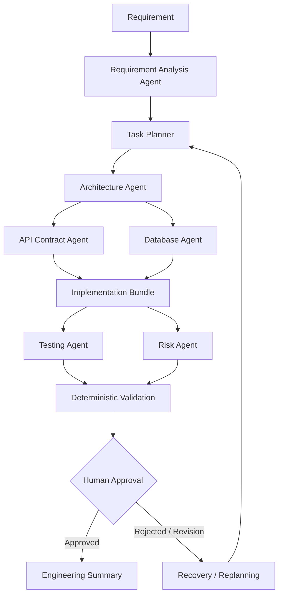

# Agentic Software Engineering System

A runnable interview-assignment prototype that turns a software requirement into a reviewable engineering outcome through a multi-step, dependency-aware agent workflow. The mandatory demonstration is a scalable URL shortener with APIs, persistence, and analytics.

## Why this exists

The system is intentionally **not a generic chatbot**. It models a software-development lifecycle workflow with structured state, task dependencies, independent task execution, retries, deterministic validation, and a human approval gate.

The repository also contains a real FastAPI URL-shortener application that can be run and tested independently.

## Architecture



Independent API and database planning tasks can execute concurrently. The orchestrator advances a task only when its declared dependencies are complete. Failures use bounded retries; exhausted failures block dependent work.

## Assignment deliverables

The repository is intentionally organized so an evaluator can map each requested deliverable to a concrete artifact:

| Requested deliverable | Repository evidence |
|---|---|
| Working prototype | `src/app/`, FastAPI URL shortener, `tests/` |
| Architecture overview | `docs/architecture.md`, `docs/agent-workflow.md` |
| Greenfield scenario | `docs/examples/greenfield.md`, `examples/output/greenfield.json` |
| Brownfield scenario | `docs/examples/brownfield.md`, `examples/output/brownfield.json` |
| Ambiguous scenario | `docs/examples/ambiguous.md`, `examples/output/ambiguous.json` |
| Setup instructions | `README.md`, `docs/final-deliverable.md` |
| Testing approach | `docs/testing.md`, executable pytest suite |
| Risks/trade-offs | `docs/risks-and-tradeoffs.md` |
| Assumptions/limitations | `docs/assumptions.md` and final engineering summary |
| Generated code/API/tests | workflow output: `generated_code.py`, `api_contract.json`, `generated_tests.py`, `test_plan.md` |
| Structured engineering summary | workflow output: `engineering_summary` |

## Recruiter note coverage

The final deliverable is a runnable URL-shortener application plus documentation covering the candidate approach, key decisions, implementation details, setup, assumptions, risks and trade-offs. It is deliberately scoped as a demoable interview prototype rather than a production-grade distributed system. See `docs/final-deliverable.md`.

## Repository layout

```text
src/app/
  agents/             Requirement, planning, architecture, contract, DB, implementation, testing, risk, summary agents
  api/                FastAPI routes
  orchestration/      Dependency-aware workflow engine
  services/           URL-shortener application service
  storage/            SQLAlchemy database and repository
  validation/         Deterministic engineering-output validator
  models.py           Workflow and API models
  config.py           Environment configuration
  main.py             FastAPI entrypoint
  cli.py              Demo CLI

tests/
  unit/               Domain/service tests
  integration/        HTTP + persistence tests
  orchestration/      Workflow, approval, brownfield tests
  e2e/                Mandatory end-to-end scenario

docs/                  Architecture, workflow, decisions, testing, risks, examples
examples/               Greenfield, brownfield and ambiguous scenario inputs
```

## Quick start

### Local

Python 3.11+ is required.

```bash
python -m venv .venv
# Linux/macOS
source .venv/bin/activate
# Windows PowerShell: .venv\\Scripts\\Activate.ps1

python -m pip install --upgrade pip
pip install -e ".[dev]"
cp .env.example .env  # Windows: copy .env.example .env
```

Run the API:

```bash
uvicorn app.main:app --reload
```

Open the generated OpenAPI UI at `http://127.0.0.1:8000/docs`.

### Run the mandatory agentic demonstration

```bash
python -m app.cli demo --output-dir ./demo-output
```

The demo uses the deterministic provider by default, so no API key is required.

To demonstrate the human checkpoint instead of auto-approval:

```bash
python -m app.cli demo --no-auto-approve
```

The workflow pauses after deterministic validation and requires an approval decision before the final summary.

## Tests and quality checks

```bash
pytest -q
ruff check src tests
mypy src
```

Or:

```bash
make all
```

## URL shortener API

### Create

```bash
curl -X POST http://127.0.0.1:8000/api/v1/urls \
  -H 'Content-Type: application/json' \
  -d '{"original_url":"https://example.com/docs"}'
```

### Redirect

```bash
curl -i http://127.0.0.1:8000/<short_code>
```

### Analytics

```bash
curl http://127.0.0.1:8000/api/v1/urls/<short_code>/analytics
```

### Health

```bash
curl http://127.0.0.1:8000/health
```

## Configuration

See `.env.example`. Important values:

- `DATABASE_URL`: SQLite locally; SQLAlchemy allows PostgreSQL as the production evolution path.
- `SHORT_CODE_LENGTH`: generated short-code length.
- `MAX_RETRIES`: bounded workflow retry count.
- `APPROVAL_REQUIRED`: whether the finalization checkpoint is enforced.
- `LLM_PROVIDER`: deterministic by default; the provider abstraction can be backed by a real LLM.
- `OPENAI_API_KEY` / `OPENAI_MODEL`: optional real-provider settings.

## Controlled autonomy

The workflow has explicit states including `PENDING`, `READY`, `RUNNING`, `COMPLETED`, `FAILED`, `RETRYING`, `BLOCKED`, `REQUIRES_APPROVAL`, `APPROVED`, and `REJECTED`.

A task cannot become executable until all declared dependencies complete. A failure is retried only up to the configured bound. Validation is deterministic where possible. Finalization requires approval when `APPROVAL_REQUIRED=true`.

## Brownfield reasoning

`BrownfieldAgent` scans a supplied repository root and reports only files actually observed. It produces a structured impact view covering likely API, service, persistence, test, and configuration areas without inventing unseen architecture.

The included brownfield example proposes adding rate limiting and API-key authentication to the existing URL shortener.

## LLM strategy

The workflow core is independent of an LLM provider. The default deterministic provider makes the assignment reproducible and testable without network access. `LLMProvider` is a small interface; `OpenAIProvider` is optional and can be enabled with the optional dependency and environment configuration.

The architecture intentionally keeps deterministic validation separate from model reasoning. A model can propose engineering artifacts, but deterministic checks and tests decide whether the result is acceptable.

## Assumptions and trade-offs

- SQLite is chosen for zero-friction local execution. A production deployment would normally use PostgreSQL and connection pooling.
- Analytics are intentionally basic: click count plus timestamp/user-agent/referrer event metadata.
- Authentication, rate limiting, expiration, custom aliases, abuse detection, and advanced analytics are not part of the mandatory requirement.
- Short-code allocation uses random generation plus a uniqueness constraint and bounded collision retry.
- The prototype does not execute arbitrary model-generated code. This avoids creating an unsafe code-execution surface in an interview demo.

## Limitations and next steps

For a production evolution, the next steps would include PostgreSQL, Redis/cache strategy, rate limiting, authentication, idempotency, distributed analytics/event processing, observability/tracing, migration tooling, CI/CD, and stronger isolation for any future generated-code execution.

## Assignment coverage

The implementation explicitly covers requirement understanding, task decomposition, dependency management, brownfield analysis, meaningful multi-step orchestration, error/retry handling, engineering artifact generation, API/schema/test outputs, validation and guardrails, controlled autonomy, human approval, and the final structured engineering summary.
