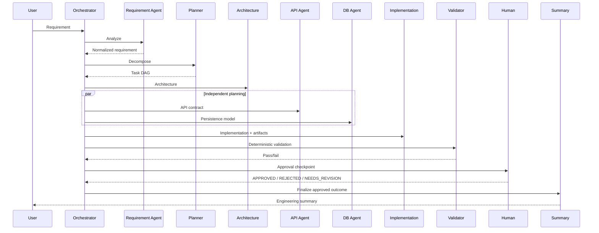

# Agent Workflow

```mermaid
sequenceDiagram
  participant U as User
  participant O as Orchestrator
  participant R as Requirement Agent
  participant P as Planner
  participant A as Architecture
  participant C as API Agent
  participant D as DB Agent
  participant I as Implementation
  participant V as Validator
  participant H as Human
  participant S as Summary

  U->>O: Requirement
  O->>R: Analyze
  R-->>O: Normalized requirement
  O->>P: Decompose
  P-->>O: Task DAG
  O->>A: Architecture
  par Independent planning
    O->>C: API contract
    O->>D: Persistence model
  end
  O->>I: Implementation + artifacts
  O->>V: Deterministic validation
  V-->>O: Pass/fail
  O->>H: Approval checkpoint
  H-->>O: APPROVED / REJECTED / NEEDS_REVISION
  O->>S: Finalize approved outcome
  S-->>U: Engineering summary
```

The actual workflow state stores task status, dependencies, outputs, errors, retry count, validation, approval, and history so the execution is inspectable.
